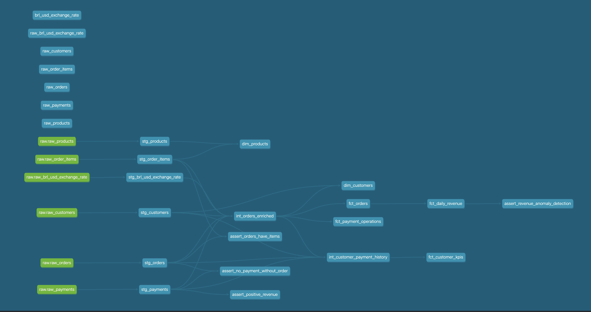

# E-Commerce Analytics — dbt Project

Production-grade dbt project demonstrating end-to-end data modeling for e-commerce analytics.

## Overview

This project transforms raw Brazilian e-commerce data into analytics-ready datasets using dbt best practices.

## Architecture

Sources (Raw CSVs)
↓
Staging (Clean & Standardize)
↓
Intermediate (Join & Enrich)
↓
Marts (Business-Ready Facts & Dimensions)


## Models

| Layer | Models | Description |
|-------|--------|-------------|
| Staging | stg_orders, stg_customers, stg_products, stg_payments, stg_order_items | Cleaned raw data |
| Intermediate | int_orders_enriched | Joined order data with metrics |
| Marts | dim_customers, dim_products, fct_orders, fct_daily_revenue | Business-ready tables |

## Features

- ✅ Source definitions with freshness checks
- ✅ Staging models with data cleaning
- ✅ Incremental fact tables
- ✅ Custom Jinja macros (datediff, surrogate keys)
- ✅ Data quality tests (built-in + custom)
- ✅ Full documentation
- ✅ CI/CD with GitHub Actions

## Lineage




## Quick Start

```bash
# Install dbt
pip install dbt-duckdb

# Clone repo
git clone https://github.com/tejasp0412/ecommerce-dbt-project.git
cd ecommerce-dbt-project

# Run pipeline
dbt seed
dbt run
dbt test
dbt docs serve

Tech Stack
dbt Core — Transformation framework
DuckDB — Local analytical database
GitHub Actions — CI/CD